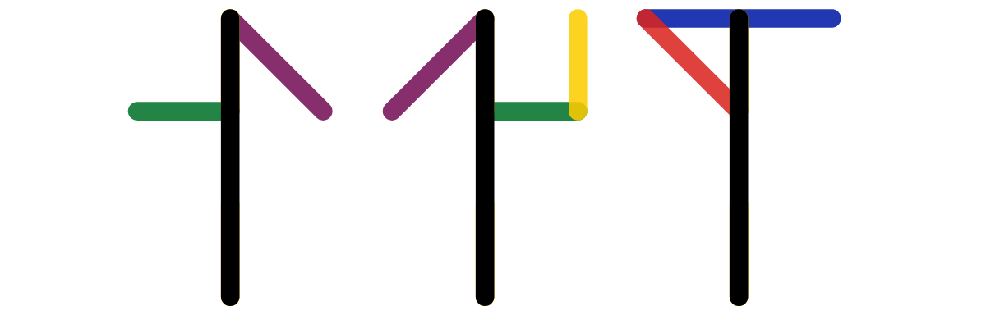
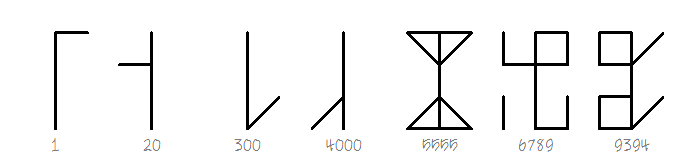
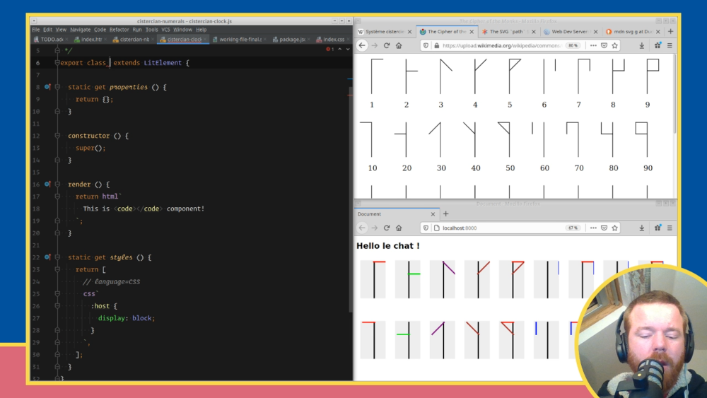
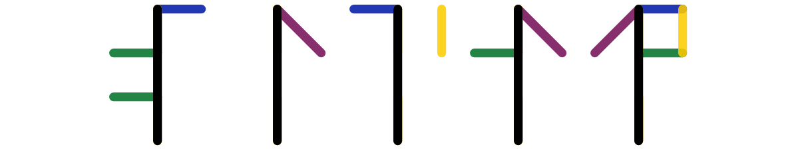

Let me tell you the story of when I tried Twitch for the first time to live-code a Web Component that displays numbers with Cistercian numerals, so I could build a clock like this:

<p>
  <cistercian-clock>
    
  </cistercian-clock>
</p>

## Yet another side project idea

Back in January 2021, I saw [a tweet](https://twitter.com/Rainmaker1973/status/1348307518045507584) about Cistercian numerals.
I was very intrigued.
If you don't know about them, here's the introduction from the [Wikipedia page](https://en.wikipedia.org/wiki/Cistercian_numerals):

> The medieval Cistercian numerals, or "ciphers" in nineteenth-century parlance, were developed by the Cistercian monastic order in the early thirteenth century at about the time that Arabic numerals were introduced to northwestern Europe. They are more compact than Arabic or Roman numerals, with a single character able to indicate any integer from 1 to 9,999.

They look like this:



I really like how compact and elegant it is to display a big number with just one symbol, especially when there is some symmetry.

A few days later, I saw [a tweet](https://twitter.com/aqandrew/status/1349762018639638528) from [Andrew Aquino](https://twitter.com/aqandrew) saying he created a React component to display any number with Cistercian numerals.
My [first reaction](https://twitter.com/hsablonniere/status/1357079582499876867) was to tweet:

> sudo make web-component

I was expecting someone to create a Web Component, so we could all have a standard compatible way to display Cistercian numbers on our websites, even if we don't use React.
Instead, out of distaste for `sudo`, my wonderful colleague [Marc-Antoine Perennou](https://twitter.com/Keruspe/) created [sudo-ng](https://github.com/Keruspe/sudo-ng).
Nothing happened, so I guess I was left with yet another side project idea.
Although this time, I decided to do it live with an audience.

## Trying Twitch for the first time

In the pre-pandemic world, I used to give talks at conferences and share my knowledge and passion for Web development.
When you code in front of hundreds of people in a conference room, everything is well-prepared and rehearsed many times.
There is a kind of illusion of simplicity, but it's the best way to go straight to the point and focus on the new stuff the audience wants to learn about.
The minor drawback is that people miss everything that happens in real life when you write code.
You read some docs, you make mistakes, you try something, you go back, you get stuck on a silly bug...

Watching someone thinking out loud and writing code without preparation is a wonderful way to learn.
You discover new IDE keyboard shortcuts.
You learn about some unknown language pattern or feature.
It feels a bit like pair-programming with a mentor.

Following a few [fellow](https://www.twitch.tv/nullpointeur) [speakers](https://www.twitch.tv/k33g_org) that got into Twitch during the first lockdown, I decided to create [my channel](https://www.twitch.tv/hsablonniere) and try the platform for this side project idea.

My main goal was to create a Web Component to display a number with Cistercian numerals and then reuse it to create a clock component that displays three Cistercian numbers: hours, minutes and seconds.
Bonus points if I could animate the lines of the symbols.

## The live-coding session



If you're interested, I posted a [recording of the session](https://www.youtube.com/watch?v=88AKamcJ-bY) on YouTube but beware:

* 👂 It's in French.
* ⌛ It's 2 hours long (<cistercian-number inline value="120">120</cistercian-number> minutes)
* 💬 The chat is NOT displayed.
* 😱 I spent way too much time on Inkscape trying to generate the initial SVG design.
* 🚧 I should have built both components before thinking about animating them.

Despite those, I really enjoyed giving this session.
Mistakes were made, but we finished with some kind of achievement.
The clock design was a bit clunky, but it worked.
It looked like this:

<video controls>
  <source src="./cistercian-clock-at-the-end-of-the-stream.mp4" type="video/mp4">
  Sorry, your browser doesn't support embedded videos.
</video>

If I were to do it again, I would prioritize the different steps, so the progress is more linear for the audience.
I would also improve the way I timebox steps, so I would stop insisting on some details.
This retrospective analysis reflects the constructive feedbacks I got from audience members afterwards.

As a host, this session was really pleasant to give, and it almost didn't require any preparation.
Between <cistercian-number inline value="60">60</cistercian-number> and <cistercian-number inline value="70">70</cistercian-number> people attended the stream, and some of them really helped me through the chat.
Apart from the code and tips, I think I managed to share the fun I had working on this side project.

I really want to do it again with other side projects ideas.
I could try more interactivity with the audience through the chat (and maybe some sounds/music).
It's very different from what I'm used to with conference talks.
The number of interesting information per minute is clearly not the same, but I don't think it's a problem in itself.
I think it's just a different way of sharing knowledge with others.
A bit slower, more interactive, less magic but definitely more authentic.

## Post-stream improvements

After the stream, I decided to improve the project:

* Implement the numbers after <cistercian-number inline value="99">99</cistercian-number>
* Fix the positioning of the different lines
* Add some animations using the [animated line drawing SVG](https://jakearchibald.com/2013/animated-line-drawing-svg/) technique 

A few weeks after, I added a few more features:

* Use CSS custom properties to allow color customization of each lines 
* Use CSS custom properties to allow line width customization 
* Add `date` mode for the clock to display year, month, day before hours, minutes, seconds
* Add `no-seconds` mode for the clock to remove the seconds
* Add `inline` mode for the number, so you can use a number inside a paragraph of text (as featured in this article if you're reading it from my site)
* Try to improve the accessibility (any feedbacks on this is welcome)

I published the source on GitHub at [hsablonniere/cistercian-numerals](https://github.com/hsablonniere/cistercian-numerals) if you're curious.

## Web Components are awesome!

Because they're exposed as Web Components, you can use them in any Web project, whatever the stack/framework you're using.
You can install them [from npm](https://www.npmjs.com/package/cistercian-numerals) but it's not mandatory at all.

As described in the [README](https://github.com/hsablonniere/cistercian-numerals/blob/master/README.md), you can use these components in your HTML without any `npm install`, without any build step or bundler.
All you need is a `<script>` tag sourcing a modern smart CDN like jspm:

```html
<!-- put this in <head> -->
<script type="module" src="https://jspm.dev/cistercian-numerals"> </script>
```

Then you'll be able to use the number component in your HTML like this:

```html
<cistercian-number inline value="12"></cistercian-number>
```

You'll also be able to use the clock component in your HTML like this:

```html
<cistercian-clock></cistercian-clock>
```

Because it's just HTML, it's also very easy to integrate in a Markdown document.
It's exactly what I'm doing right now with this article, but you need to browse it from [my site](https://www.hsablonniere.com).
Here's the date + time (without seconds) example:

<p>
  <cistercian-clock date no-seconds>
    
  </cistercian-clock>
</p>

Please see the [README](https://github.com/hsablonniere/cistercian-numerals/blob/master/README.md#components) for more details about how to use and customize the components.

## References & Links

* [Cistercian numerals](https://en.wikipedia.org/wiki/Cistercian_numerals) on Wikipedia
* [Recording of the Twitch session](https://www.youtube.com/watch?v=88AKamcJ-bY) on YouTube
* [Source code](https://github.com/hsablonniere/cistercian-numerals) on GitHub
  * [Source code for &lt;cistercian-number&gt;](https://github.com/hsablonniere/cistercian-numerals/blob/master/src/cistercian-number.js) on GitHub
  * [Source code for &lt;cistercian-clock&gt;](https://github.com/hsablonniere/cistercian-numerals/blob/master/src/cistercian-clock.js) on GitHub
* [JavaScript package](https://www.npmjs.com/package/cistercian-numerals) on npm
* [Animated line drawing SVG](https://jakearchibald.com/2013/animated-line-drawing-svg/) by Jake Archibald
* [LitElement](https://lit-element.polymer-project.org/), the library I used to build the Web Components
* [Web Dev Server](https://modern-web.dev/docs/dev-server/overview/), the dev server I use for live preview
* [Cistercian SVG](https://adrianroselli.com/2021/02/cistercian-svg.html) by Adrian Roselli 
* [p5js based cistercian clock](https://ednl.github.io/cistercian-clock/?size=80) by E. Dronkert
* [Arduino + dot matrix cistercian clock](https://hackaday.io/project/178131-monklock) by Danjovic
* [Smart watch face cistercian clock](https://getwatchmaker.com/watchface/cistercian-clock) by Philip McGeehan
* [React based cistercian number component](https://twitter.com/aqandrew/status/1349762018639638528) by Andrew Aquino
* [React based cistercian number component](https://mz8i.com/cistercian) by Maciej Ziarkowski
* [Clairvo](https://github.com/TiroTypeworks/Clairvo), a proof-of-concept font that uses OpenType Layout to implement Cistercian numerals

## Thank you

😍 Thank you wonderful people who attended the stream and thank you wonderful reviewers for your time: [Alexandre Berthaud](https://alexandre.berthaud.me/).
