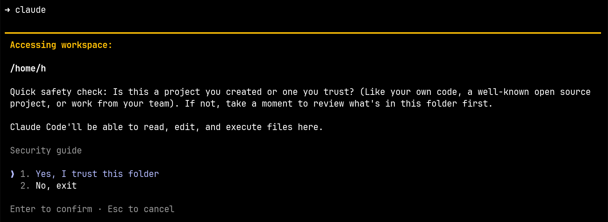
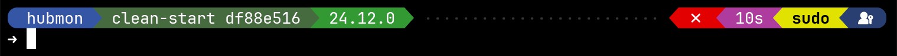
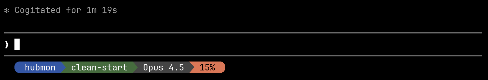
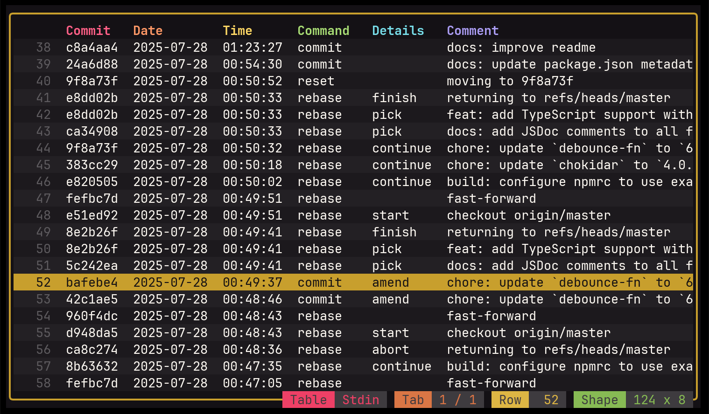

Let me tell you the story of how, after ignoring [dotfiles](https://dotfiles.github.io/) for 15 years, I finally gave in and accidentally turned a simple config folder into my personal tiny config workshop.

## 💻 New machine, new habits

As I mentioned in my [previous article](/down-the-rabbit-hole-with-claude-code-my-journey-to-window-key-switcher--2qyq57/) (feel free to read it first if you haven't), I got a new laptop in August 2025.
A new machine is always a good opportunity to revisit some tools, some habits and discover new ones.

I changed quite a few things, and among them, I switched from [zsh](https://www.zsh.org/) to [fish](https://fishshell.com/).
Several colleagues were using it, the autocompletion looked nice, call me a fashion victim but I wanted to try it out.

One of the many differences between fish and zsh is how you define custom commands.
Fish supports aliases, but it also has a richer function system where you can add a description, customize autocompletion and so on.

For example, here's the simple zsh `gb` alias I had that helped me switch between git branches:

```zsh
alias gb='git branch'
```

Now here's the `gb` fish function I created:

```fish
# Now I have a description
function gb --description "List branches or switch to branch"
  if test (count $argv) -eq 0
    # Without argument: list branches
    git branch
  else
    # With argument, switch.
    git switch $argv
  end
end

# Autocompletion branches, sorted by most recently used
complete -c gb -f -a '(git for-each-ref --sort=-committerdate refs/heads --format="%(refname:short)")'
```

Wow, subtle but nice improvement.
Once I did that, I wanted to convert all my other aliases into fish functions.
I wanted to add descriptions, autocompletion, parameters.
All these little things that would make me more productive, or at least give me the illusion of productivity: the joy of a custom-made setup.

But between my git aliases, system aliases, and everything else I had accumulated over the years, I was looking at 80+ of them.
No way I was going to do that by hand.

## 🤖 Please Claude Code, help me

Around that time, I was using [Claude Code](https://docs.anthropic.com/en/docs/claude-code) more and more.
I had this "aha moment" when I realized Claude Code was way more than just a coding assistant for software projects.
Once you open it in a folder, it can leverage anything available on your machine: run commands, read/write files, access other tools.
It's not just about code, it's a general-purpose automation companion.
Migrating my zsh aliases to fish functions was a perfect job for it.

Once that was done, I wanted more.
I started thinking about all the other configs I could manage this way: my terminal, my editor, my git setup.
One thing kept bothering me though: where should I open Claude Code for this kind of work?

When I'm working on a project, it's easy, I just open it in the project folder.
But for system stuff, configs, shell functions, where do I go?
In `~/.config`?
Nice but not practical, some configs like git are directly in the home directory.
Well I tried opening Claude Code in my `~` and it showed me a warning:



I think it shows this warning for any project now, but at the time, I'm pretty sure there was a special warning for the home directory.
Opening an AI agent in my home directory means giving it read and write access to everything: my SSH keys, my tokens, my work projects, my photos...
Even if I trusted this tool (which, let's be honest, I don't entirely), that's way too much.

## 🦸 dotfiles to the rescue

I remembered this thing I'd been hearing about for so many years: [dotfiles](https://dotfiles.github.io/).

Until then, it never really clicked for me.
I always thought it was for people who wanted to quickly set up a new machine, or sync configs between multiple computers.
I only have one machine, and I do [regular full backups](https://github.com/restic/restic), so I never really had that need.

My use case was different, I wanted a dedicated space to work on the configuration of my system.
A folder I can open with Claude Code without giving it access to everything else.
A folder I can publish on GitHub because I make sure there's nothing sensitive in it.

That's basically what dotfiles are: gathering all your configs in one place, version the whole thing with git and publish it online.

But here's the catch: these files need to exist in specific locations to work.
My git config has to be in `~/`, my fish functions in `~/.config/fish/`, my Claude settings in `~/.claude/`.

## 📁 Hello Stow, nice to meet you

That's where [GNU Stow](https://www.gnu.org/software/stow/) comes in, a symlink manager that's been around since 1993.
This thing is older than some of the tools I'm configuring with it.

The idea is simple: you organize your configs by tool in subfolders, and in each subfolder you recreate the structure you want in your home directory like this:

```
dotfiles/
├── fish/
│   └── .config/
│       └── fish/
│           ├── conf.d/
│           │   └── 30_keybinding_alt_h_help.fish
│           └── functions/
│               └── gb.fish
├── ghostty/
│   └── .config/
│       └── ghostty/
│           └── config
├── git/
│   ├── .gitconfig
│   └── .gitignore_global
└── vscode/
    └── .config/
        └── Code/
            └── User/
                └── keybindings.json
```

Each tool folder mirrors the structure it needs in your home directory.
For example, `fish/` contains `.config/fish/...` because that's where fish expects its config.

When you run `stow *`, it creates symlinks in your home directory pointing back to your dotfiles:

```
~/
├── .config/
│   ├── fish/
│   │   ├── conf.d/
│   │   │   └── 30_keybinding_alt_h_help.fish -> ../../../../dotfiles/fish/.config/fish/conf.d/30_keybinding_alt_h_help.fish
│   │   └── functions/
│   │       └── gb.fish -> ../../../../dotfiles/fish/.config/fish/functions/gb.fish
│   ├── ghostty/
│   │   └── config -> ../../../dotfiles/ghostty/.config/ghostty/config
│   └── Code/
│       └── User/
│           └── keybindings.json -> ../../../../dotfiles/vscode/.config/Code/User/keybindings.json
├── .gitconfig -> dotfiles/git/.gitconfig
└── .gitignore_global -> dotfiles/git/.gitignore_global
```

There are other tools like [chezmoi](https://www.chezmoi.io/) or [yadm](https://yadm.io/) that do similar things with more features.
I didn't take the time to look into them, the GNU way seemed more than enough for my needs.

## ⚡ My new workflow

With this setup, I naturally and progressively discovered a new workflow.

Now, when I need an improvement of my setup, I open Claude Code in my dotfiles folder and prompt.
Most of the time, the Haiku model is more than enough for these small tasks.

### ✨ Simple examples

> Create a `gb` fish function that lists branches when called without arguments, and switches to a branch when given one as argument. Add autocompletion that lists branches sorted by most recently used.

A few seconds later, I get exactly what I described earlier.

> Add keyboard shortcuts to VS Code to handle multi-cursor, `alt+r` to add, `alt+shift+r` to remove.

It edits `keybindings.json`, done.
I don't need to know the VS Code name of this feature, I just trust it to do the right thing.
If it goes sideways, I can just rollback with git.

> Add the same keyboard shortcuts I have in VS Code to Ghostty for splitting panes horizontally and vertically.

Since Claude Code has access to all my configs, it can read one and apply the same logic to another.

### 💭 About this workflow

Before all this, creating a shell function was a micro-project: find the docs, write the thing, test, debug.
Now I just open my tiny config workshop, describe what I want and bam, I get it.
It's even more fluid now that I use [Handy](https://handy.ai/) to dictate my prompts.
No more "I'll do it later", I just do it now because I know it's going to be easy and quick.

As a result, I create way more shortcuts, functions and tools for myself than before.
I also have more consistency in keyboard shortcuts across my different tools.

Even for configs that aren't in my dotfiles, I still open Claude Code from this folder.
Need to change a GNOME shortcut?
I ask from here, it uses `gsettings`, done.

Most of the time, for simple things, it just works and I don't think twice.
That can be a trap though.
AI models make mistakes.
For more complex stuff, I take the time to review the generated code, but there's usually not that much.
And since I publish everything on GitHub, I try not to commit garbage, which also keeps me careful.

## 🧰 Steal from my workshop

Since I started this, I've had quite a few occasions to share config snippets with colleagues.
Before, I had to copy-paste config in Slack.
When someone asked on social media, sharing code was even more painful.
Now I just send a link to the file on my GitHub.

And with this article, I finally have the occasion to share with you too, dear readers.
Nothing groundbreaking here, just a bunch of small things I find fun and practical.
Feel free to steal them.

### 🆘 Alt+h in fish: instant help

Instead of typing `--help`, pressing enter, reading the output, then pressing up arrow to go back and removing ` --help`, I just press `Alt+h`.
It runs the current command with `--help` at the end, displays the output, and puts me back on my command line with what I had typed still there.

🔗 [fish/.config/fish/conf.d/30_keybinding_alt_h_help.fish](https://github.com/hsablonniere/dotfiles/blob/main/fish/.config/fish/conf.d/30_keybinding_alt_h_help.fish)

I got the idea from the built-in `Alt+s` shortcut that toggles `sudo ` at the beginning of a command.
I made a few more like this to toggle things at the end of a command:

- `Alt+j` for `-F json`: 🔗 [fish/.config/fish/conf.d/30_keybinding_alt_j_json.fish](https://github.com/hsablonniere/dotfiles/blob/main/fish/.config/fish/conf.d/30_keybinding_alt_j_json.fish)
- `Alt+k` for `| jless`: 🔗 [fish/.config/fish/conf.d/30_keybinding_alt_k_jless.fish](https://github.com/hsablonniere/dotfiles/blob/main/fish/.config/fish/conf.d/30_keybinding_alt_k_jless.fish)
- `Alt+l` for `| less`: 🔗 [fish/.config/fish/conf.d/30_keybinding_alt_l_less.fish](https://github.com/hsablonniere/dotfiles/blob/main/fish/.config/fish/conf.d/30_keybinding_alt_l_less.fish)

### ⭐ Terminal prompt with Starship

I spent quite some time on my terminal prompt with [Starship](https://starship.rs/).
I'm colorblind, so I try to pick colors that work for me and have good contrast.
I also took care to choose these round corners and chevron ASCII characters that give it a nice design.

My latest additions: indicators on the right side showing whether I'm in sudo mode or if my 1Password is unlocked.



🔗 [starship/.config/starship.toml](https://github.com/hsablonniere/dotfiles/blob/main/starship/.config/starship.toml)

### 📊 Claude Code statusline

Claude Code lets you customize the status line at the bottom.
It gives you a few things about the current session so you can be creative with it.
Mine displays the current folder and the git branch with a similar style as my terminal prompt.
And I added the current model.



Something I added recently after watching [this video](https://www.youtube.com/watch?v=rmvDxxNubIg) is the context window usage percentage.
Bonus: when it goes above 59%, it turns red.
People call it the "dumb zone" because Claude tends to get less reliable when the context is that full.
Some even say you should start a new conversation at 40%.

🔗 [claude/.claude/statusline.js](https://github.com/hsablonniere/dotfiles/blob/main/claude/.claude/statusline.js)

### 🕐 git reflog in a TUI

When I mess up with Git (which happens more often than I'd like to admit), `git reflog` is there to save my skin.
But the default output is really hard to scan.
So I made a `grf` function that transforms it into CSV and pipes it to [tw](https://github.com/shshemi/tabiew), a nice TUI for browsing tabular data.



🔗 [fish/.config/fish/functions/grf.fish](https://github.com/hsablonniere/dotfiles/blob/main/fish/.config/fish/functions/grf.fish)

These are just a few examples.
Browse the repo, dig around, be curious.

## 🔒 A note on security

I wasn't super keen on publishing my dotfiles at first.
I had doubts about whether some of it might be too personal or sensitive.

What reassured me is that people have been doing this for fifteen years.
You just need to be careful about what you commit and stay organized.

For git, I have a separate private config (with my email etc.) that's not in the repo.
And I also have fish functions that stay local, for work-related stuff I don't want to share.
I put them directly in `~/.config/fish/functions/`.

## 🏁 Conclusion

I ignored dotfiles for 15 years because I thought they were for power users with multiple machines.
Turns out they're just a good excuse to have a tiny config workshop.

What started as a way to safely use Claude Code on my configs became something I actually enjoy maintaining.
The workflow is so frictionless that it really pushes you to create and improve your own small utilities.
I learned things I would never have explored otherwise: fish function descriptions, autocompletion customization, Starship prompt modules...
It also pushed me to rationalize my keyboard shortcuts across tools, to unify behaviors, to think more deliberately about my setup.

Creating custom configs and shortcuts is a great way to dig into things you use every day but never really understood.
And once you start, it's hard to stop.

If you've been hesitating like I was, just start with one config file and see where it takes you.

Here's mine: [github.com/hsablonniere/dotfiles](https://github.com/hsablonniere/dotfiles)

Steal freely, suggest generously.
