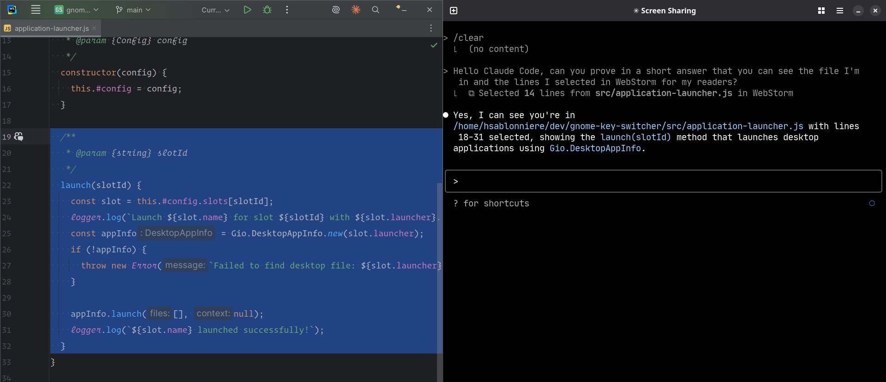
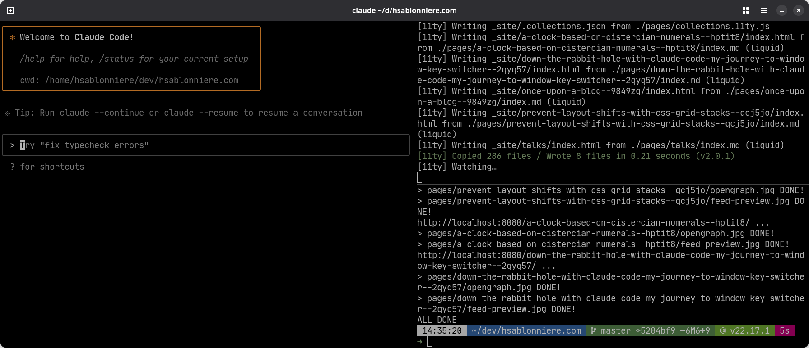

Let me tell you the story of when I finally tried out Claude Code and ended up in a multi-level rabbit hole that led me to create [Window Key Switcher](https://github.com/hsablonniere/window-key-switcher), a GNOME Shell extension for keyboard-driven window management.

## 👋 Hello Claude Code

I've been very skeptical about LLMs and coding agents since they appeared a few years ago.
The AI hype cycle, with all its bold claims about replacing developers entirely, and promises of instant app creation, made my eyes roll several times, especially regarding frontend code and accessibility.
I hesitated for a long time before diving into these tools, but like any good engineer, I cannot have a strong opinion without basing it on experience.
I needed to learn and understand what they could and could not do, which is actually very hard as everything evolves all the time.
Sometimes I was disappointed, sometimes I was impressed, but none of the tools I tried really clicked with me to the point of completely reconsidering my workflow.

None of them until I tried Claude Code.

I think it comes down to the fact that Claude Code is a terminal based interface.
With VS Code forks like [Cursor](https://cursor.com/) or [Windsurf](https://codeium.com/windsurf), I need to open a project and then, my brain automatically goes _"I'm in an IDE, I'm supposed to ask the agent to write code"_.
With Claude Code (and competitors like [Gemini CLI](https://ai.google.dev/gemini-api/docs/cli), [Open Code](https://github.com/ModelBest/OpenCode), or [Codex](https://openai.com/research/codex)), my brain goes _"I'm in a terminal, I can do anything I want on my computer"_.
In his [Claude Code is My Computer](https://steipete.me/posts/2025/claude-code-is-my-computer) article, Peter Steinberger described something really close to the mind shift I went through recently.
Bonus point, Claude Code can connect with WebStorm so I can keep using the IDE I love and know how to use very well.

## 💰 Level -1: Buying new monitors

Most of the time, when I work at home or at my co-working space, I use two monitors.
I have my IDE on my laptop and my browser on a desktop monitor above it.
Anytime I need my terminal, I use a single hotkey to show/hide it on the monitor that has the mouse.
I've been working like this for years!

Using Claude Code more and more, I started multi-tasking with several terminal tabs opened in parallel.
It was so annoying to switch between them, it resurrected an old wish I had: upgrading my monitor setup to 4 monitors.
I had this simple (and maybe dumb) thought process: if I had more screen real-estate, I could see different terminal windows at the same time and watch how each Claude Code session is doing while still being able to use my browser, IDE...

That's how I convinced myself to buy two reconditioned [portable 15-inch USB-C monitors](https://www.msi.com/Portable-Monitor/PRO-MP161-E2/Overview).
They're light, I can bring them on the go.
I experimented with using them vertically, something I hadn't really tried before.
But now that I had all these terminal windows, I felt the urge to be able to split my terminal windows vertically and/or horizontally.

## 🔍 Level -2: The terminal emulator quest

First, I tried [tmux](https://github.com/tmux/tmux), again.
It wasn't my first attempt with it, but like the last time, I didn't click with the shortcuts.
They're too weird and complex for me.
Also, I don't need the session system, and the mouse support doesn't really work natively.

So I went looking for a new terminal emulator.
I'd been using [xfce-terminal](https://docs.xfce.org/apps/terminal/start) since my XFCE days and was still using it after switching back to GNOME.
That's when I stumbled upon [Ghostty](https://ghostty.org/).
It provides native window multiplexing with keyboard shortcuts to "split left" or "split down", and it's great.

I've been using it for a few days now and I won't go back to xfce-terminal.

By the way, Ghostty's configuration is done with a config file, no GUI, no wizard.
No problem, I told Claude Code:

- look for my xfce-terminal custom color palette on my system (no idea where it's stored)
- run `ghostty +show-config --default --docs` to get the list of options and docs about them
- use the output to ask me questions as some kind of configuration wizard
- create the config file for me

The only problem I have for now with Ghostty is the lack of Linux (with X11) support for a "dropdown mode" (they call it "quick-terminal").
As I described before, I'm addicted to having a single hotkey to show/hide my terminal on the top half of my screen (or fullscreen sometimes).

## 🔨 Level -2.5: The bash script

I spent an evening trying to hack together a bash script that would mimic a dropdown behavior using [`xdotool`](https://github.com/jordansissel/xdotool).
Again, I asked Claude Code.
It worked... more or less.
But the window placement was goofy.
It comes down to the limits of what `xdotool` can do vs. a more precise approach.
I went to bed with a working but not that satisfying solution.

## 🚀 Level -3: The GNOME Shell extension

The next morning, I wanted more, I wanted a better and more powerful version of this bash script.
That's when I decided to create a GNOME Shell extension.
I also acknowledged I was now an official resident of this rabbit hole, but it was fun so I stayed.

I had already built [one extension](https://github.com/hsablonniere/window-manager-http) to control my desktop windows with HTTP with my custom slide tool for my [HTTP cache talk](https://www.youtube.com/watch?v=xtpaQ8_mmKM).
But I actually had very little knowledge and experience with GNOME Shell extensions.
Back then, I mostly mimicked and adapted an existing extension I saw on GitHub and I remembered going through the API docs was a mess.

I started describing my idea to Claude Code:

- Ten hotkeys: `Super + number-key`
- Assign any app to a number
- Press the hotkey:
  - If the app is not launched, launch it
  - If the app is launched, focus the window
  - If the app has multiple opened windows, focus the next one like Alt+Tab would do (this was not that simple)
- Bonus: highlight the window that was just focused

### 💩 The first "vibe coded" attempt

I used "plan mode" to create a detailed set of steps with user experience details and code structure instructions.
I did a few iterations to refine the plan and once I was satisfied, I told it to go forward.
Claude Code took around 9 minutes to build the extension.
I was already thinking "great, I'll install it and move on to a real project".

I installed it and it failed.
The basics were there, but several details were broken. Also, I forgot to tell it to use [Context7](https://context7.ai/), so it targeted an old version of GNOME Shell and it didn't use the latest ESM syntax.

### 👥 The pair programming sessions

Going deeper into my rabbit hole, I decided to code the extension myself (with Claude Code's assistance, of course), but using the opportunity to learn about the GNOME Shell extension ecosystem I knew very little about.

I already had a similar failed "generate everything in one go" experience on another project.
My lack of knowledge and experience on the stack prevented me from being able to fix it myself.

I deleted everything and asked Claude to start a pair programming session with me.
The idea was to progress step by step, learning new APIs and techniques along the way, and making sure everything worked before going to the next step.

We started by creating a simple GNOME Shell extension that logs "Hello, world!" when it's enabled and this time, we used Context7!

For reference, here's the [GNOME Shell Extensions documentation](https://gjs.guide/extensions/) we used throughout the development process.

Then we focused on the basic moves we needed for the choreography:

- Listening to a keyboard shortcut
- Reading keyboard shortcuts configurations
- Listing opened windows
- Focusing a window
- Launching a program
- Highlighting a window

For some of these, Claude Code proposed multiple alternative options I had to chose from.
It found like 5 ways to launch an application.
In the end, I never browsed the API docs once and most of the code it produced worked as is.

Once I had working code for these basic moves, I could have gave another chance to the "generate everything in one go" method.
Instead, I chose to continue iterating and learning...
This allowed me to try different ways to architect the code.
I wanted something really clean and organized and mostly used to browser and Node.js projects.
I also took some time to automate some tooling for the project.

<!-- mermaid diagram showing the modules of the project -->

## 🎉 A satisfying outcome

In the end, I have a working GNOME Shell extension that does exactly what I wanted.
The first time I had the right behavior, I smiled like a child with an ice cream.

Now, I can focus my terminal with one hotkey.
I don't really need the dropdown behavior anymore.
I don't need to hide it, I just need to focus another application like my browser or my IDE with a single hotkey.
I'm still in the "muscle memory shift" phase, I actually did a few Alt+Tabs between my markdown editor and the browser while writing this article.

I pushed the code on [GitHub](https://github.com/hsablonniere/window-key-switcher) but as I'm writing this, I haven't published it on the GNOME Extensions site yet.
I want to take some time to use it for a while first.
If you're curious, you can install it locally and test it, please give feedback.

### ⏭️ The future of this project

I guess, I'll see how I use it in different situations:

- on-the-go with laptop only
- classic setup with laptop + monitor
- new mega setup with laptop + monitor + 2 portable vertical monitors

I also have a few ideas for improvements and next steps:

- Try to automate test and run them with GJS and/or Node.js with mocks.
- Experiment with having the same app on multiple shortcuts. So if I have 2 terminal windows, I could focus the one I want with just one shortcut. I'm not sure I really need that, and I don't know how I would implement it.
- Refine the README and the CONTRIBUTING guidelines.
- This project gave me a lot of ideas for other extensions, and even to restart my [Window manager HTTP](https://github.com/hsablonniere/window-manager-http) extension and publish it!

### 🤯 Learning new things

As I already mentioned, I learned a lot on this project:

- I have a better understanding of what GNOME Shell extensions can and cannot do with their APIs (keybindings, windows management...).
- The [GJS](https://gjs.guide/) JavaScript runtime now supports ESM.
  - No more legacy `const MyModule = Me.imports.myModule`!
- Some people created [type definitions for GJS](https://github.com/gjsify/ts-for-gir) and [GNOME Shell extensions](https://github.com/gjsify/gnome-shell).
- You can't import from `node_modules` directly, but you can bundle your code before installing your extension.
  - I used [Zod](https://zod.dev/) and bundled with [esbuild](https://esbuild.github.io/), and it works great!

In the end, I mostly architected the project myself.
Most of the code was generated and then I reworked it to my tastes.
Claude Code was a really good pair programming buddy and a GNOME Shell extension know-it-all (once I told it to use Context7 and to look up a few extension repos on GitHub).

I used this project as an opportunity to improve my understanding of LLMs and coding agents
I tried to find a good balance between full blind vibe-coding and typing each character in the `.js` files.
I really think my workflow was improved through this process.

### ⚠️ Struggling with challenges

This should have been a simple project but I stumbled upon a few difficulties along the way:

- The iteration cycle is a bit annoying. Each time I want to test the code, I need to build the extension and reload GNOME Shell. I'm used to live-reload in the browser or automatic restarts with Node.js. Even with the scripts I created, it's still a pain.
- Listening to keyboard shortcuts is kinda limited but I guess it's for security reasons.
- I mentioned there are type definitions for extensions but most people use them in `.ts` files. I prefer writing `.js` files with JSDoc and use TypeScript CLI `tsc` to typecheck. This was a bit harder to understand how to configure.
- It took me some time to figure out what I wanted for the window focus cycle behavior.
- I almost rage-quitted once I realized someone already made [a very similar extension](https://extensions.gnome.org/extension/6057/happy-appy-hotkey/).
  - I don't know how I missed it in my early research.
  - I'm glad I built my own solution, it's closer to what I need and I learned a lot.

## 🏁 Conclusion

What started as simply using Claude Code more intensively led to buying monitors, switching to a new terminal emulator, and ultimately building a GNOME Shell extension.
It even pushed me to write this article, which is so rare, this blog/site  almost became a joke.

Sometimes the best projects come from scratching your own itch, following the rabbit hole wherever it leads, whatever how deep, especially if you learn along the way.

Window Key Switcher might be a simple extension, but it perfectly solves my specific workflow needs.
And the journey of building it taught me about an entirely new ecosystem I barely explored before.
It also improved my understanding of LLMs and coding agents.

That's the beauty of side projects - they're never just about the end result.
