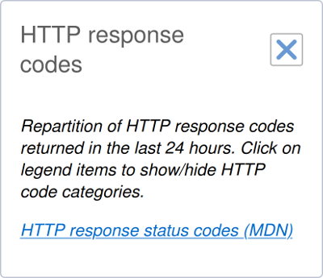

There are two reasons why people use CSS grid:

1. 😎 CSS is awesome! It's a fact, deal with it. 
1. 🛠️ Grid is a great tool to build complex two-dimensional layouts.

I sometimes have a third reason to use CSS grid: prevent **layout shifts**.
I tried to find a fancy acronym for this technique but all I got was ALSGST: _"Anti Layout Shift Grid Stacking Technique"_.
I guess I won't be receiving many skill endorsements for "coining tech terms" on my LinkedIn profile so you better send me some suggestions.

Let me explain the technique using real examples.
In this article, I'll cover:

* The real layout shift problem I faced with a component I worked on.
* The limitations of solving it with absolute positioning.
* The benefits of solving it with grid. 

> Wait, what is a layout shift anyway?

A layout shift is what happens when an update in a web page causes something to move significantly.
Most of the time, layout shifts occur during page load while the contents progressively renders.
For example, when an image with an unspecified height gets inserted in the page, just before the very paragraph you were reading, the text moves away and it gets pretty frustrating.
This is also very common when third party scripts (ad services or partnered contents) append new unknown elements in the page.

This article will focus on layout shifts occuring when toggling state on a UI component.
I won't cover layout shifts happening during page load.

## Let's get some context

I work for [Clever Cloud](https://www.clever-cloud.com/en/), an IT automation platform.
Our clients push their code and we handle the rest for them: build, deploy, host, scale, maintain, recover and so on.
When they need to configure their applications, databases and other services, they use our web UI: "the console".
I spend most of my time on this project and it looks like this:


What you see in the screenshot above is the overview of my own website, a Node.js application, hosted on our platform.
On the right, you can see a pie chart representing the repartition of HTTP response codes returned by the application in the last 24 hours.


When I worked on this component, I tried to keep things simple.
I imagined our users would implicitly understand the chart is related to the current application.
To unclutter the display, I decided to move some details like the exact number of requests in tooltips, accessible via mouse or touch.
With the chart all cleaned up, I faced a problem. 
How would I explain the following details?

* The chart only displays data from the last 24 hours.
* Each item in the legend can be clicked to show/hide the different status code categories. Thank you [Chart.js](https://www.chartjs.org/)!

The available space was too small to add a detailed title at the top or bottom of the chart.
So to help our users figure this out, I added an information button ℹ️ in the top right corner.
When this button is clicked, the chart is hidden and a short text is displayed instead.
It looks like this:



When the close button is clicked, the short text is hidden and the chart displayed again.
Implementing this toggle behaviour was not that hard.
Let's take a simplified version of the template:

```html
<div class="chart-component">
  <div class="title">
    HTTP response codes <button>toggle chart/info</button>
  </div>
  <div class="chart">
    <!-- chart here -->
  </div>
  <div class="info">
    <!-- short text here -->
  </div>
</div>
```

In this HTML, I can, when the button is clicked, simply toggle the component state between `.chart` and `.info` and hide the appropriate panel with `display: none`.

## Layout shift problems

This approach has one big problem, it is subject to **layout shifts**.

> Why is that?

When I work on such components, I tend to follow what I consider a good practice: don't set a fixed height on the component, let it adapt to its own content.
This is even more important in this situation because I have no way to know how much space is needed to display the short text (without scrollbars).
The minimum required height will depend on:

* The unknown width of the component, which depends on usage context
* The length of the short text, which depends on the language (english or french)

The result is, the component height is a bit smaller containing the chart than containing the short text.


The issue is worse in french because the text is a bit longer:


Depending on the situation, this innocent looking height change can have big impacts on the whole layout and the scroll position.
This kind of details can drive your users crazy:

* Best case scenario, other parts of the layout slightly move.
* Worst case scenario: the button under the mouse cursor moves and something else is placed under (hello Twitter search input).

The video below shows what happens when I toggle between states.

<video controls>
  <source src="./console-overview-shift.mp4" type="video/mp4">
  Sorry, your browser doesn't support embedded videos.
</video>

You can observe a first layout shift when I go from "chart" to "info".
The bar chart moves down and the map gets bigger.

Now look what happens when I scroll down the page and go back to the "chart" state.
Look carefully at the mouse cursor.
Once over the button, I don't move it, yet a simple click triggers a chain reaction:

* The height of the component is reduced to display the chart.
* The height of the whole page is reduced.
* The whole page is scrolled up a bit.
* The mouse cursor is no longer above the button and is now above some text.

Now, how can we prevent this layout shift from happening?

## The absolute position solution

Before CSS grid, I would have solved this problem with the [position CSS property](https://developer.mozilla.org/en-US/docs/Web/CSS/position).

First, I would use `visibility: hidden` instead of `display: none` to hide the "inactive" panel:


As you can see, with `visibility: hidden`, the "inactive" panel is hidden but the component computes its own size as if both panels were there.
Now, I have a component with a stable height, based on the heights of `.chart` and `.info`.

Then, I would use `position: absolute` on the `.chart`.
Doing this will [remove the element from normal flow](https://developer.mozilla.org/en-US/docs/Web/CSS/position#absolute).
This means the component will compute its own size as if `.chart` was not there.
Therefore, the component size would mostly depend on the size of `.info`, which is exactly what I want.

The only step left is to give `.chart` exactly the same position and size as `.info`.
Using `position: absolute` means `.chart` will be positioned *"relative to its closest positioned ancestor"*.
That is, an ancestor with a `position` different from the default value (`static`).
Most of the time, I use `position: relative` on the parent to trigger this.
In this situation, I would need an additional `.wrapper` around both panels like this:

```html
<div class="chart-component">
  <div class="title">
    HTTP response codes <button>toggle chart/info</button>
  </div>
  <div class="wrapper">
    <div class="chart">
      <!-- chart here -->
    </div>
    <div class="info">
      <!-- short text here -->
    </div>
  </div>
</div>
```

Now that I have this HTML, the CSS solution would look like this:

```css
.wrapper {
  /* .wrapper is the closest positioned ancestor of .chart */
  position: relative;
}

.chart {
  /* .chart is removed from normal flow, therefore
     .wrapper has the exact same size (and position) as .info
     because .info is the only child left in the normal flow
     .chart is positioned relatively to .wrapper */
  position: absolute;
  /* same position as .wrapper (thus same position as .info) */
  left: 0;
  top: 0;
  /* same size as .wrapper (thus same size as .info) */
  height: 100%;
  width: 100%;
}
```

This `position: absolute` solution helps me achieve my goal.
The size of my component will now always depend on the size of `.info`, even when it's hidden and `.chart` is visible.

🤔 No more layout shifts when I toggle between states but still a few limitations:

First, I had to add a `.wrapper` with a `position: relative` just so I could use `position: absolute` on `.chart`.
CSS is awesome but it's also tricky to master.
If you're still struggling with how the position CSS property works, this approach can be scary but don't worry:

* It's OK. You're not alone!
* It gets better with time and practice... 

Second, I had to assume the component size would only depend on `.info`.
In more complex situations, I could have more than just two panels where I cannot assume which one should guide the size of the whole component.  

Now, let's find out how grid can solve this better.

## The grid solution

CSS grid are supported in [all evergreen browsers](https://caniuse.com/css-grid) now.
This means we can rely on the fact that you can place and overlap multiple elements in the same grid area.

> What do you mean by grid area?

If you're not familiar with CSS grid, before continuing this article, I would advise you to:

* Watch any talk from [Rachel Andrew](https://twitter.com/rachelandrew). She's awesome and in this [recent video](https://www.youtube.com/watch?v=g1osnSY9mSU) she did with [Jason Lengstorf](https://twitter.com/jlengstorf), they explain CSS grid through live coding examples.
* Always have the CSS-Tricks [Complete Guide to Grid](https://css-tricks.com/snippets/css/complete-guide-grid/) open in a tab.
* Practice, practice, practice...

Now that you're more familiar with CSS grid, we can talk about the now famous _"Anti Layout Shift Grid Stacking Technique"_ (sorry).
Let's take the initial simple template we had earlier:

```html
<div class="chart-component">
  <div class="title">
    HTTP response codes <button>toggle chart/info</button>
  </div>
  <div class="chart">
    <!-- chart here -->
  </div>
  <div class="info">
    <!-- short text here -->
  </div>
</div>
```

If we use CSS grid on `.chart-component` like this:

```css
.chart-component {
  display: grid;
  gap: 1rem;
}
```

Our component looks like this:


Thanks to the awesome [CSS Grid Inspector](https://developer.mozilla.org/en-US/docs/Tools/Page_Inspector/How_to/Examine_grid_layouts) from Firefox DevTools, we have annotations for columns and rows.
We can see that:

* `.title`, `.chart` and `.info` are between column 1 and 2
* `.title` is between row 1 and 2
* `.chart` is between row 2 and 3
* `.info` is between row 3 and 4

This is the default behaviour in a simple 1 column grid: children are placed in order.
With `grid-column` and `grid-row`, we can force an element to be placed in a specific area of the grid.

For example, if we place our two elements in the same area like this:

```css
.chart,
.info {
  grid-column: 1 / 2;
  grid-row: 2 / 3;
}
```

The result looks like this:


If you are sceptikal, remember the appropriate panel will be hidden with a `visibility: hidden`.

With this technique, we actually told the CSS engine to prepare a grid where the area at column `1 / 2` and row `2 / 3` should adapt to what's inside.
In other words: this very area will always be as big as the biggest between `.chart` and `.info`.
Therefore, the height of the whole component will be the same when toggling between states.

<video controls>
  <source src="./console-overview-no-shift.mp4" type="video/mp4">
  Sorry, your browser doesn't support embedded videos.
</video>

😎 No more layout shifts!

Compared to the absolute position solution, we improved the situtation:

* No need to add a `.wrapper`
* Would work fine with more than two panels
* No need to assume which panel needs to guide the whole component size

Now, as a bonus, let me show you another real example where I used this technique.

## Preventing horizontal shifts

The previous example was about the height of a component but you can also use this technique with width.
If you give another look at the Clever Cloud console overview, in the top right corner, you'll notice a few buttons to control your app's state.


The "Stop app" button has bigger horizontal paddings than the other buttons.
This is because, when clicking this very button, the text is replaced with "Click to cancel" for 3 seconds in case you ~~panick~~ changed your mind.

If we didn't use the grid technique; when the button changes its text from "Stop app" to "Click to cancel", the width change would move all the other buttons like this:


On narrow screens, the wrapping of the buttons could trigger a bigger layout shift like this:

<video controls>
  <source src="./stop-button-shift.mp4" type="video/mp4">
  Sorry, your browser doesn't support embedded videos.
</video>

Thanks to the  _"Anti Layout Shift Grid Stacking Technique"_ (please send naming suggestions, I'm dying), no need to assume which state will be larger.
Whatever the lengths of the _normal text_ and the _cancel text_ are, the button will always be big enough.


<video controls>
  <source src="./stop-button-no-shift.mp4" type="video/mp4">
  Sorry, your browser doesn't support embedded videos.
</video>

😎 No more layout shifts!

I hope this article helped you consider this kind of layout shifts as a potential problem to solve.
I also hope you'll find this technique useful in your own projects.

## References & Links

About CSS and grid:

* [CSS position property reference](https://developer.mozilla.org/en-US/docs/Web/CSS/position) on MDN
* [CSS Grid Layout support in browsers](https://caniuse.com/css-grid) on Can I use
* [Let’s Learn CSS Grid! (with Rachel Andrew)](https://www.youtube.com/watch?v=g1osnSY9mSU) on Jason Lengstorf YouTube channel
* [Complete Guide to Grid](https://css-tricks.com/snippets/css/complete-guide-grid/) on CSS-Tricks 
* Please consider using Firefox and their awesome [CSS Grid Inspector](https://developer.mozilla.org/en-US/docs/Tools/Page_Inspector/How_to/Examine_grid_layouts)

The pie chart component and the button component are part of Clever Cloud's component library.
The code is open-sourced on GitHub and the documentation (with live preview) is published with [Storybook](https://storybook.js.org/).

You can find out more about the components we talked about here:

* [Charts.js](https://www.chartjs.org/): the JavaScript library used for those charts
* `<cc-tile-status-codes>`: the pie chart component
  * [Source code](https://github.com/CleverCloud/clever-components/blob/master/src/overview/cc-tile-status-codes.js)
  * [Docs with live preview](https://www.clever-cloud.com/doc/clever-components/?path=/story/%F0%9F%9B%A0-overview-cc-tile-status-codes--data-loaded)
* `<cc-button>`: the button component with "click to cancel"
  * [Source code](https://github.com/CleverCloud/clever-components/blob/master/src/atoms/cc-button.js)
  * [Docs with live preview](https://www.clever-cloud.com/doc/clever-components/?path=/story/%F0%9F%A7%AC-atoms-cc-button--delay-and-outlined)

## Thank you

😍 Thank you wonderful reviewers for your time: [Julien Durillon](https://twitter.com/juuduu/), [Alexandre Berthaud](https://alexandre.berthaud.me/), [Anthony Ricaud](https://ricaud.me/blog/), [Sarah Haïm-Lubczanski](https://twitter.com/mereteresa) and [Ralf D. Müller](https://twitter.com/RalfDMueller).
