⚠️ This page is still a work in progress.

Here's a list of the conference talks I gave over the past few years.

## Compression on the Web: how do we (re)take control?
<!--## La compression Web : comment (re)prendre le contrôle ?-->

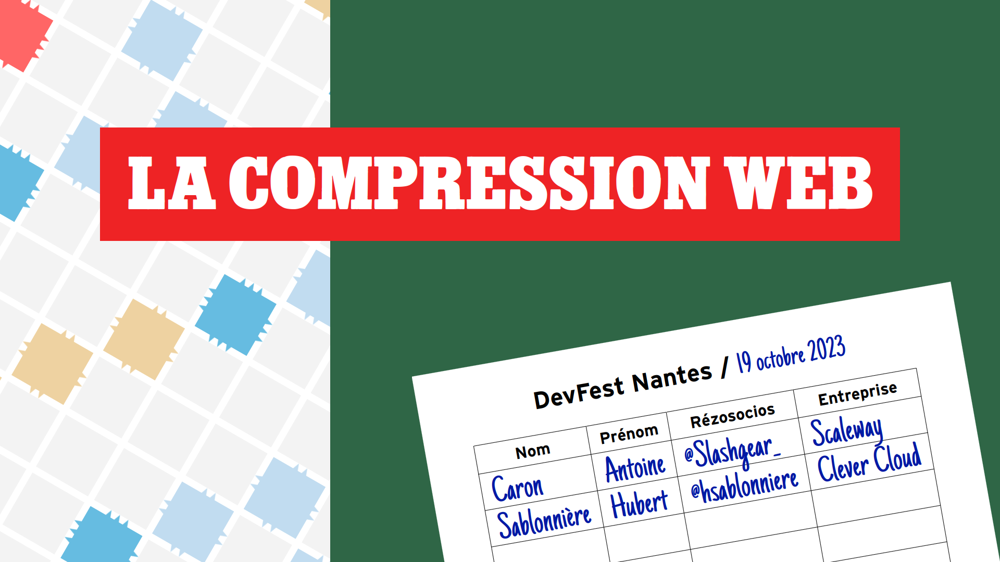

This talk was co-presented with [Antoine Caron](https://blog.slashgear.dev).

No video yet.

## #BackToBasics: HTTP cache
<!--## #RetourAuxSources : Le cache HTTP-->

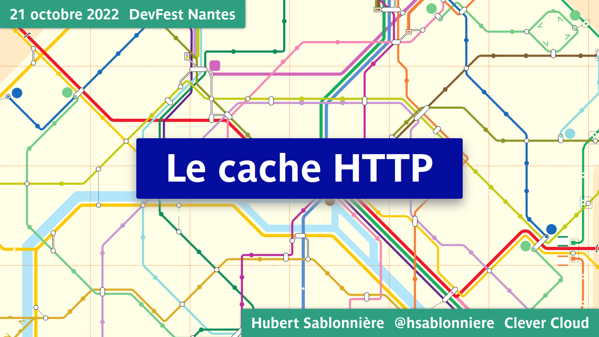

* 📺 [DevFest Lille 2023 (french)](https://www.youtube.com/watch?v=Tfag9MPb6YM)
* 📺 [Devoxx France 2023 (french)](https://www.youtube.com/watch?v=AJT5EJP_QmQ)
* 📺 [MiXiT 2023 (french)](https://vimeo.com/showcase/4407825/video/826105481)
* 📺 [DevFest Nantes 2022 (french)](https://www.youtube.com/watch?v=xtpaQ8_mmKM)

## In this jungle of JavaScript tools, is a return to simplicity still possible?
<!--## Dans cette jungle de l’outillage JavaScript, un retour à la simplicité est-il encore possible ?-->

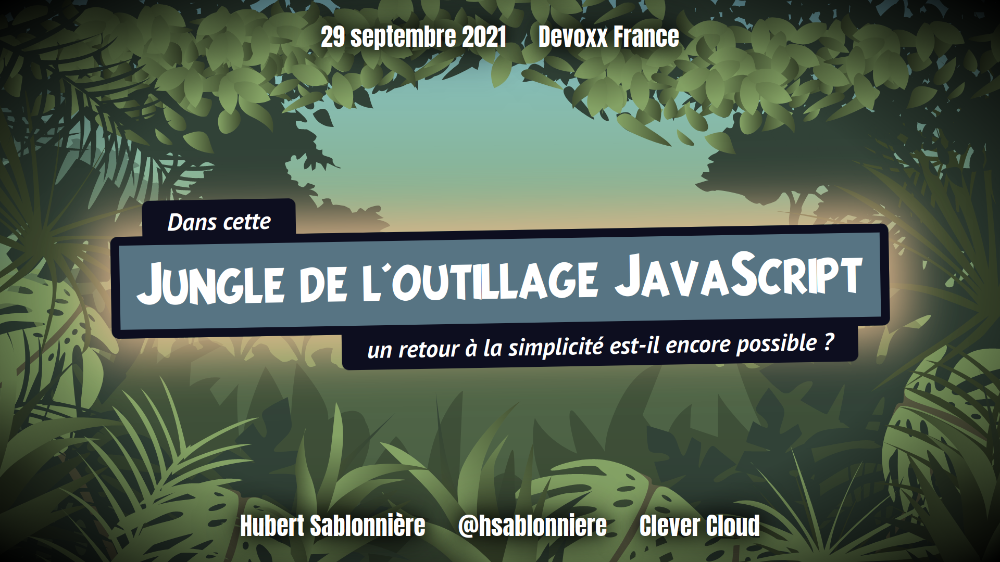

* 📺 [WeLoveSpeed 2021 (french)](https://www.youtube.com/watch?v=5tz5AqRbez8)
* 📺 [Devoxx France 2021 (french)](https://www.youtube.com/watch?v=t52gxrBGAIQ)

## The Web, its frameworks and its standards: deconstructing them for a more resilient code base
<!--## Le Web, ses frameworks et ses standards : déconstruire pour mieux (re?)construire-->

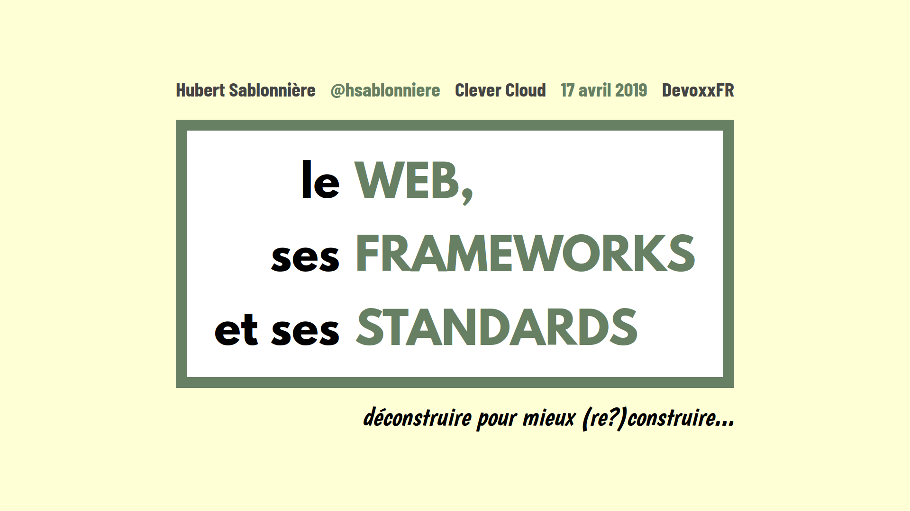

* 📺 [DevFest Nantes 2019 (french)](https://www.youtube.com/watch?v=HEELMZ29GwQ)
* 📺 [DevFest Lille 2019 (french)](https://www.youtube.com/watch?v=3HW2k15R55A)
* 📺 [Devoxx UK 2019 (english)](https://www.youtube.com/watch?v=ipej_DrIca4)
* 📺 [MiXiT 2019 (french)](https://vimeo.com/showcase/4407825/video/340680619)
* 📺 [Devoxx France 2019 (french)](https://www.youtube.com/watch?v=uFxVH5mFAKg)

## #BackToBasics: HTTP Cookies
<!--## #RetourAuxSources : Les cookies HTTP-->

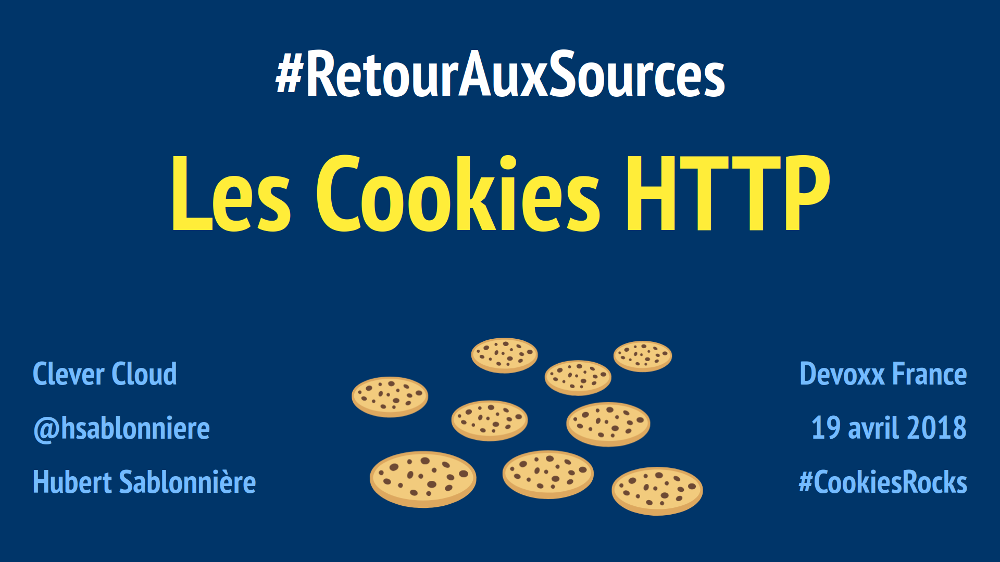

* 📺 [DevFest Toulouse 2018 (french)](https://www.youtube.com/watch?v=CcTbecZ67_o)
* 📺 [Devoxx Belgium 2018 (english)](https://www.youtube.com/watch?v=y6mwekHkgVQ)
* 📺 [DevFest Lille 2018 (french)](https://www.youtube.com/watch?v=dv7Ny4hr-AQ)
* 📺 [Devoxx UK 2018 (english)](https://www.youtube.com/watch?v=bNXsmc7wPJc)
* 📺 [Devoxx France 2018 (french)](https://www.youtube.com/watch?v=KL9MR721c4w)
* 📺 [MiXiT 2018 (french)](https://vimeo.com/showcase/4407825/video/269807247)
* 📺 [BreizhCamp 2018 (french)](https://www.youtube.com/watch?v=MKQ8gUGdKGs)

## An ultrasonic adventure!
<!--## Une aventure ultrasonique !-->

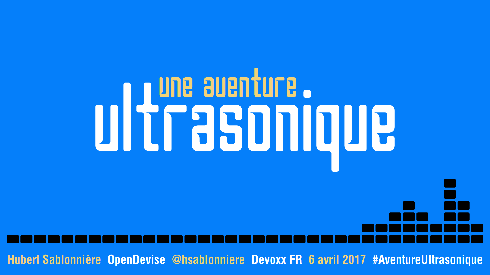

* 📺 [Devoxx Belgium 2017 (english)](https://www.youtube.com/watch?v=g9ti7uHjqvc)
* 📺 [Devoxx UK 2017 (english)](https://www.youtube.com/watch?v=O447hZomoT0)
* 📺 [Devoxx France 2017 (french)](https://www.youtube.com/watch?v=rfEJY7lRrbM)

## Documentation as code (explained to my dad)
<!--## Documentation as Code (expliqué à mon père)-->

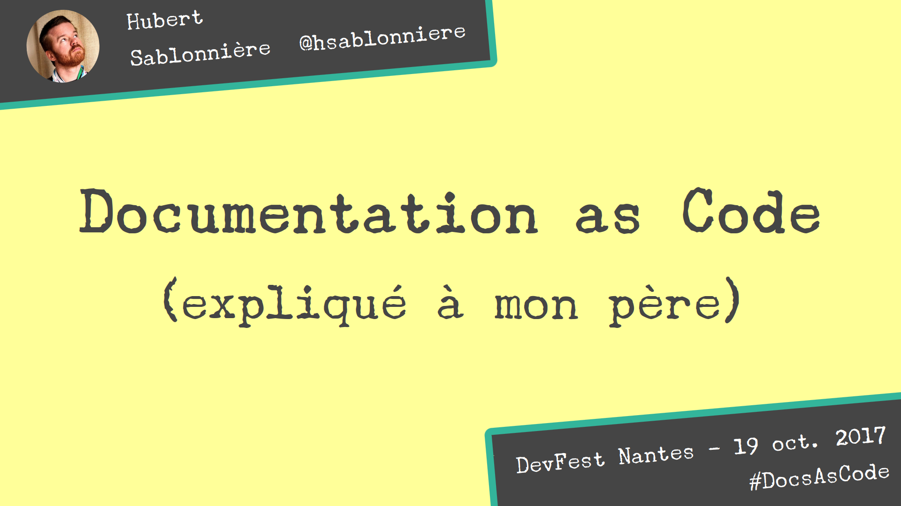

* 📺 [Devoxx Belgium 2017 (english)](https://www.youtube.com/watch?v=ggBv_pZDu0c)
* 📺 [DevFest Nantes 2017 (french)](https://www.youtube.com/watch?v=T6YJlaY0Dpw)
* 📺 [Meetup (french)](https://www.youtube.com/watch?v=1rKgVF5CEEY)

## 100% Stateless with JWT
<!--## 100% Stateless avec JWT-->

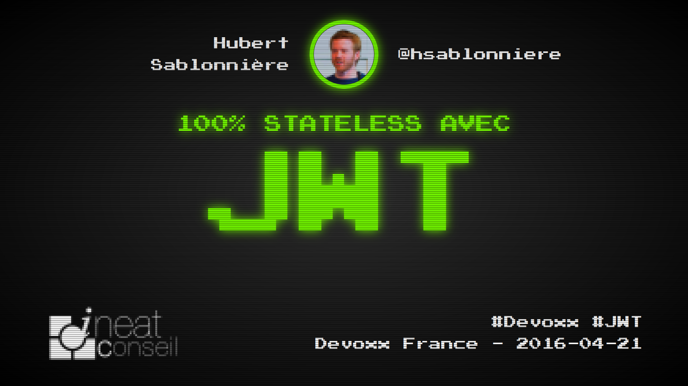

* 📺 [Devoxx Belgium 2016 (english)](https://www.youtube.com/watch?v=67mezK3NzpU)
* 📺 [BDX.io 2016 (french)](https://www.youtube.com/watch?v=ILKzajWgSC0)
* 📺 [Devoxx France 2016 (french)](https://www.youtube.com/watch?v=A2-YImhNVMU)

## Make CSS Fun Again with Flexbox!
<!--## Flexbox, et le CSS redevient fun !-->

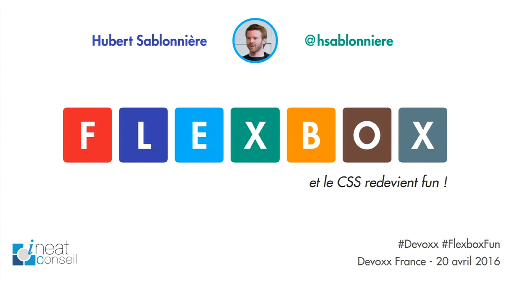

* 📺 [Devoxx Belgium 2016 (english)](https://www.youtube.com/watch?v=1oKlYgsnyfw)
* 📺 [Devoxx France 2016 (french)](https://www.youtube.com/watch?v=5F_ngjHDcJQ)

## Progressive Web Apps: The future of the Web is here
<!--## Progressive Web Apps : Le futur du Web arrive-->

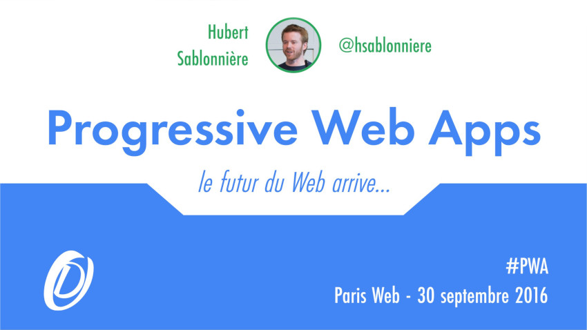

* 📺 [BDX.io 2016 (french)](https://www.youtube.com/watch?v=dSKp-76Ur6E)
* 📺 [Paris Web 2016 (french)](https://vimeo.com/showcase/4407825/video/194400035)

## The Star Wars Machete Order

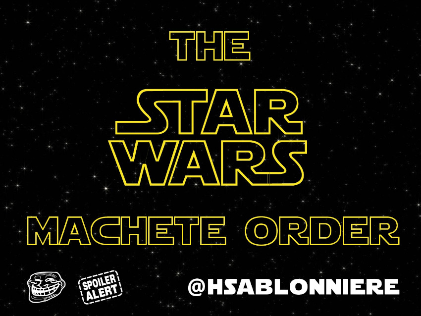

This was my first [ignite talk](https://en.wikipedia.org/wiki/Ignite_%28event%29) and I wanted to talk about
the [Star Wars machete order](https://www.rodhilton.com/2011/11/11/the-star-wars-saga-suggested-viewing-order/).
It was a really fun experience!

## From Jurassic Web to offline-first and more with Service Workers
<!--## La révolution hors-ligne du Web arrive avec les Service Workers-->

My friends and my ISP try to convince me that we're all connected.
It's a lie.
We are all "almost connected" and the only pattern to build fast Web apps that don't need the network all the time is to
think about offline-first.

This talk covers the annoying AppCache and its magnificent successor: the Service Workers with all the new specs that
come along.

* 📺 [Riviera Dev 2015 (french)](https://www.youtube.com/watch?v=I_CHxZ3EsiQ)
* 📺 [Devoxx Belgium 2015 (english)](https://www.youtube.com/watch?v=SltjVpgTaCo)
* 📺 [Devoxx France 2015 (french](https://www.youtube.com/watch?v=rCjVVYt5Qoo)

## CSS for newbies
<!--## CSS pour les nuls-->

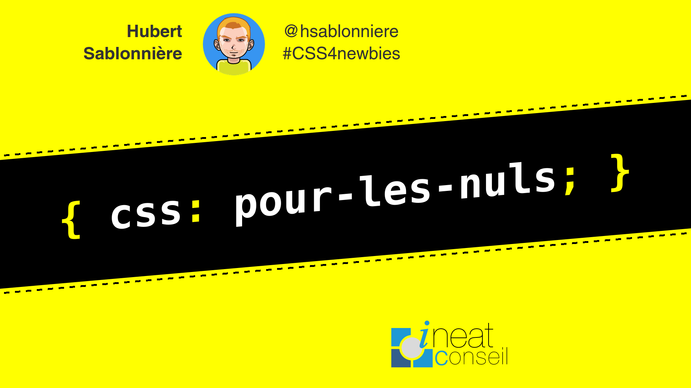

CSS is not a only a language for designers.
You can have really bad taste for colors and style and still learn how to place rectangles on a screen.

This is a quick live coding session covering the very basics of CSS: display, box-model, position and floats.

* 📺 [BDX.io 2015 (french)](https://www.youtube.com/watch?v=Y0xnthLHZP0)
* 📺 [Devoxx France 2015 (french)](https://www.youtube.com/watch?v=Yyns0uD3Qu4)

## Recipes for a multi-screen Web
<!--## Les recettes du web multi-écran-->

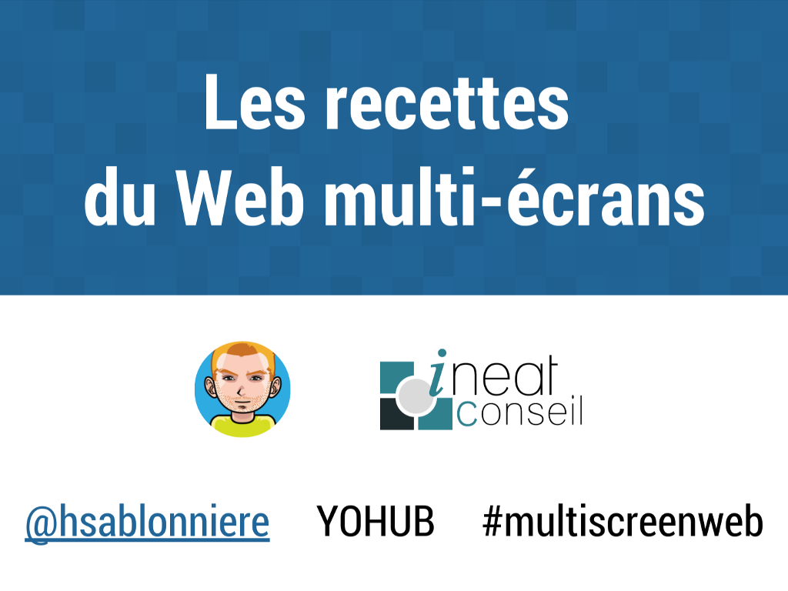

Working with a dual screen setup is not longer reserved to elites like developers or designers.
Web applications can offer multi-screen user experience.
There's a lot of good ergonomics reasons and a few interesting techniques to discover.

* 📺 [Devoxx France 2017 (french)](https://www.youtube.com/watch?v=5zFd_ZQZ7V0)
* 📺 [Blend Web Mix 2015 (french)](https://www.youtube.com/watch?v=1CMZx2OCDr0)
* 📺 [Scotland JS 2015 (english)](https://www.youtube.com/watch?v=-o8B4TE18gI)
* 📺 [Paris Web 2014 (french)](https://vimeo.com/showcase/4407825/video/113839942)

## git++: Let's go to the next level of version management
<!--## git++ : Passez au niveau supérieur de la gestion de version-->

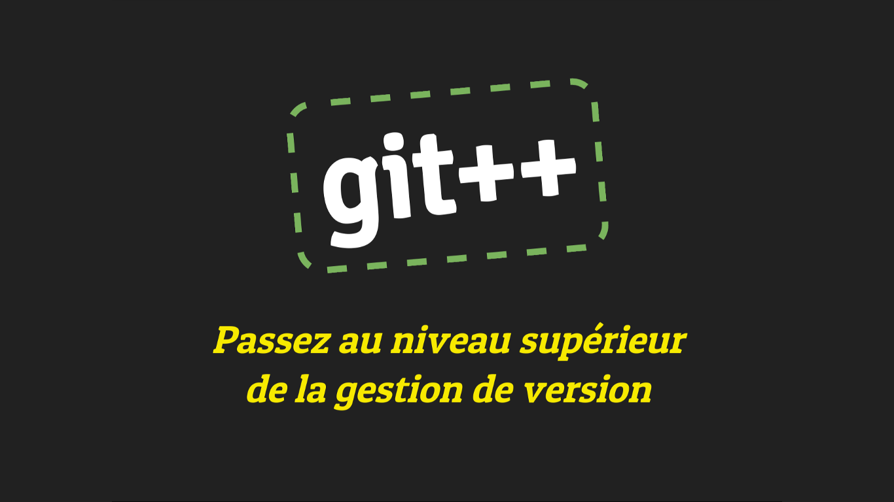

This talk was co-presented with [Cyril Lakech](https://twitter.com/cyril_lakech).

We all use git everyday but it is still often used like SVN. With git rebase and some good conventions we can have a
clean code history and help developers, product owners and users!

* 📺 [Codeurs en Seine 2014 (french)](https://www.youtube.com/watch?v=rt-9mPaYtKo)
* 📺 [Devoxx France 2014 (french](https://www.youtube.com/watch?v=m0_C2cfM9IM)

## HTML5, cookies are not alone anymore
<!--## HTML5, les cookies ne sont plus seuls au monde-->

From cookies to latest HTML5 APIs, a presentation of different technologies, patterns, examples, and gotchas about
offline and storage in the browser.

* 📺 [Meetup (french)](https://vimeo.com/showcase/4407825/video/70552951)
